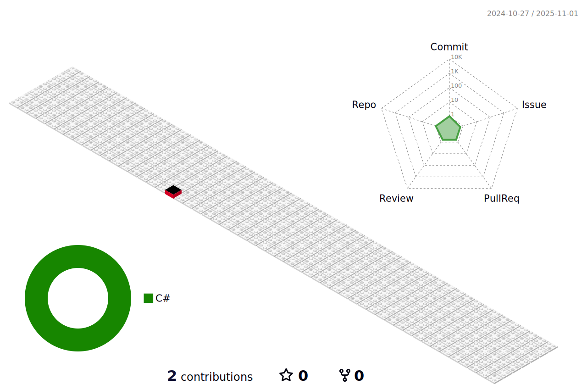

REPOSITORY:  
 [TIPS FOR VIM](https://github.com/mortalis91/learnIT/blob/main/TIPS_FOR_VIM)  
 [TIPS FOR BASH](https://github.com/mortalis91/learnIT/blob/main/TIPS_FOR_BASH)  

CONTACT:  
   
 @mortalis_91  

